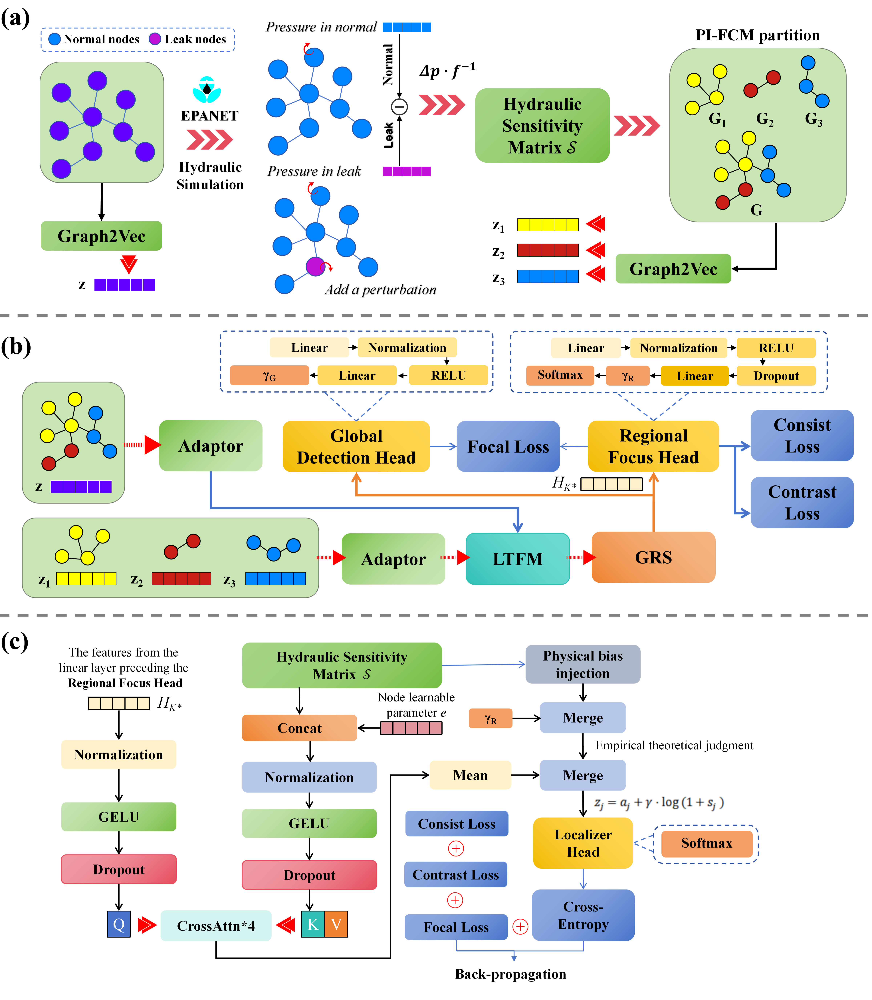

<div align="center">
<h1>Bridging Physics and Data: A Hierarchical Graph Intelligence for Water Leak Localization</h1>

[**[Paper]**]('') [**[Project Page]**](https://github.com/mutianwei521/TFFM)

</div>
Tianwei Mu, Guangzhou Institute of Industrial Intelligence

This is the official code for the paper **Physics-Informed Graph Intelligence Enables Interpretable Leak Localization in Water Distribution Networks**.

We introduce **Tri-Focus Feature Matching (TFFM)**, a transformative Physics-Informed Graph Intelligence framework that embeds rigorous hydraulic constraints directly into the neural computation graph. TFFM acts as a "glass-box", solving the notoriously difficult inverse problem of leakage localization in Water Distribution Networks (WDNs).

---

## 🌟 News
- **[2026.03.18]** Code and pre-trained models are officially released!

---

## 💡 Abstract
Leakage localization in Water Distribution Networks (WDNs) is a critical inverse problem hindered by data scarcity and hydraulic non-linearity. Existing methods struggle to balance physical rigor with computational flexibility, often resulting in "black-box" models lacking interpretability. In this study, we propose **Tri-Focus Feature Matching (TFFM)**. Our innovation lies in a hierarchical "Look-Three-Times" mechanism that progressively constrains the solution space: 
1. **Global** graph embeddings detect system-wide anomalies (Look 1); 
2. **Regional** variational attention maximizes mutual information to isolate hydraulically coherent zones (Look 2); 
3. A novel **Physics-Informed Node Localizer (PINL)** integrates the hydraulic sensitivity matrix as a hard inductive bias (Look 3). 

This architecture ensures predictions are not merely statistically likely but physically consistent with fluid mechanics. Validated on benchmark networks (e.g., L-Town), TFFM achieves near-perfect accuracy and superior resilience to sensor noise.

---

## 🚀 Architecture overview

TFFM progressively narrows the diagnostic scope from global leak detection (Look 1), to regional sub-partition isolation (Look 2), and finally to precise nodal pinpointing (Look 3), establishing a scale-invariant "glass-box" interpretability.



---

## 📈 Main Results

TFFM was rigorously evaluated across six benchmark water distribution networks, ranging from the small tutorial `Net1` to the real-world municipal scale `City H` (920 junctions).

### 1. Superior Localization Accuracy
TFFM significantly outperforms both traditional physics-based models and state-of-the-art Deep Learning (DL) and Physics-Informed Machine Learning (PIML) baselines across all network scales.

**Table: Comparative Classification Performance (Node-Level Accuracy %)**

| Method | Type | Net1 | EXA4 | EXA5 | EXA6 | EXA7 | City H |
|---|---|---|---|---|---|---|---|
| B2: Bayesian IS | Model-based | 87.70 ± 1.62 | 63.56 ± 1.48 | 70.89 ± 1.38 | 72.33 ± 1.24 | 69.78 ± 1.32 | 65.78 ± 1.68 |
| B1: Hier. RF | Classic ML | 86.50 ± 1.12 | 60.44 ± 1.52 | 67.22 ± 1.52 | 68.78 ± 1.46 | 65.56 ± 1.44 | 62.44 ± 1.82 |
| B3: Deep MLP | Black-box DL | 81.60 ± 2.12 | 58.44 ± 2.12 | 62.33 ± 2.12 | 64.44 ± 2.18 | 61.89 ± 2.24 | 59.78 ± 2.14 |
| B4: Soft-PINN | Soft-PIML | 79.10 ± 2.02 | 56.78 ± 2.18 | 61.11 ± 2.24 | 62.67 ± 2.04 | 60.33 ± 2.12 | 58.22 ± 2.22 |
| B5: AIGNN | Physics-GNN | 70.90 ± 3.52 | 54.33 ± 2.04 | 59.11 ± 2.02 | 60.44 ± 2.02 | 58.56 ± 2.08 | 55.67 ± 2.12 |
| **TFFM (ours)** | **Hard-PIML + Hier.** | **99.30 ± 0.32** | **77.08 ± 2.06** | **87.31 ± 1.22** | **91.82 ± 1.34** | **86.07 ± 1.88** | **86.51 ± 2.58** |

### 2. Multi-Stage "Look-Thrice" Cascading Precision
By progressively narrowing the searching space, TFFM retains extremely high accuracy across Micro, Small, Medium, and Large leak events.

**Table: Performance Across Leak Categories (Average)**

| Leak Category | Look 1: AUC (%) | Look 2: Top-1 (%) | Look 3: Node-Level ±1-hop (%) |
|---|---|---|---|
| Micro | 81.56 | 67.71 | 51.04 |
| Small | 94.47 | 81.25 | 68.75 |
| Medium | 98.81 | 89.58 | 76.39 |
| Large | 99.82 | 96.53 | 83.33 |
| **Simulation Avg** | **100** | **99.84** | **86.51** |

### 3. Noise Robustness and Computational Efficiency
TFFM exhibits remarkable resilience to sensor noise, maintaining high node-level accuracy (>81%) on the massive `City H` network even at high noise levels (e.g. 5% to 10% pressure disruption). 

Furthermore, the inference time is exceptionally efficient: For the largest `City H` network, real-time prediction completes in an average total time of just **2.36 ± 1.57 ms**, enabling immediate operational responses across the entire municipal WDN.

---

## 🛠️ Getting Started

### 1. Prerequisites
- Python 3.8+
- PyTorch (>= 2.0.0)
- EPANET 2.2
- CUDA 11.8
- Other dependencies in `requirements.txt`

Clone the repo and install dependencies:
```bash
git clone https://github.com/yourusername/TFFM-WaterNetwork.git
cd TFFM-WaterNetwork
pip install -r requirements.txt
```

### 2. Data Preparation
For default execution, the network topologies (e.g., `Net1.inp` or `L-Town.inp`) and configurations are specified via `config.yaml`.
- Ensure your structural graph representations and hydraulic simulations are properly placed in `data/`.
- Perform the Phase I Offline Initialization by calculating the sensitivity matrix.

### 3. Training
To train the TFFM model using default configurations:
```bash
python main.py --mode train
```
Or use custom parameters (e.g., number of scenario data augmentations):
```bash
python main.py --mode train --n-scenarios 1000
```
This script handles the end-to-end composite loss optimization for the Global Adaptor, regional LTFM layers, VT Selector, and finally the Physics-Informed Node Localizer.

### 4. Evaluation & Inference
During inference, TFFM applies its "Look-Thrice" cascade seamlessly.
```bash
# Real-time monitoring mode
python main.py --mode inference

# Batch prediction with external test data
python main.py --mode inference --test-data data/test.csv
```

---

## 📂 Project Structure

```text
TFFM-WaterNetwork/
├── data/                  # WDN topological files (*.inp) and datasets
├── logs/                  # Training logs
├── output/                # Evaluation output and results
├── src/                   # Core TFFM source code
│   ├── data/              # Hydraulic data processors and EPANET wrapper
│   ├── models/            # TFFM models: Adaptor, LTFM Layers, VT Selector, PINL
│   ├── training/          # Composite loss functions and trainer logic
│   ├── inference/         # Prediction engine
│   └── utils/             # Graph2Vec encoders, FCM Partitioning
├── config.yaml            # Hyperparameters and running configuration
├── main.py                # Main executable program
├── requirements.txt       # Environment dependencies
└── README.md              # Project documentation
```

---

## 🏷️ Citation

waiting to continue

---

## 📝 License
This project is released under the [MIT License](LICENSE). See the LICENSE file for more details.

---

## 👏 Acknowledgement
We extend our gratitude to the PyTorch team and the contributors of EPANET frameworks which greatly facilitated this research into intelligent WDNs.
